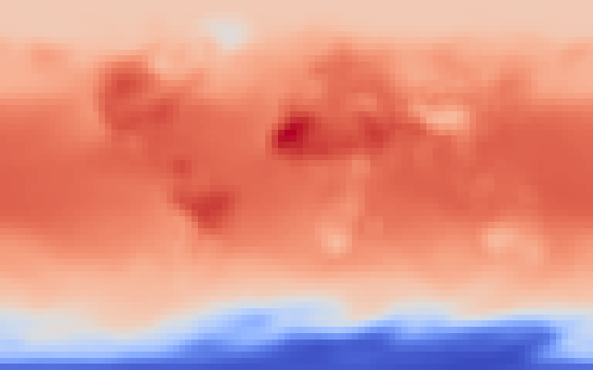
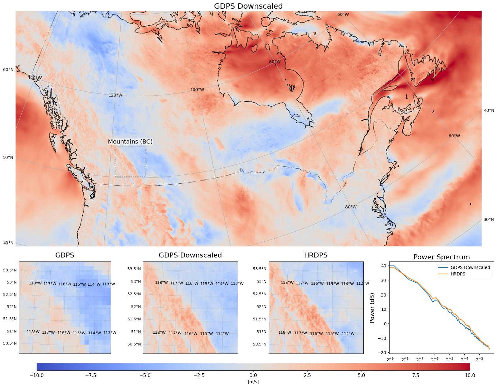

# granite-wxc

This repository contains code and examples to apply the [Prithvi WxC foundation model](https://github.com/NASA-IMPACT/Prithvi-WxC) to downscaling tasks. In particular, the repository contains both code and instructions for generic fine-tuning tasks as well as fine-tuned models for MERRA2 2m temperature and the ECCC v10 and u10 wind components as reference.

<p align="center">
   
   <br><em>Figure 1: 6x downscaling of MERRA-2 2m temperature</em>
</p>

</br>

<p align="center">
   
   <br><em>Figure 2: 8x downscaling of ECCC's u10 wind component</em>
</p>

## Getting started

1. Create a virtual environment
2. Clone this repository as well as that of the foundation model. Install both in the virtual environment.:
   ```
   git clone https://github.com/NASA-IMPACT/Prithvi-WxC
   git clone https://github.com/IBM/granite-wxc.git
   cd Prithvi-WxC
   pip install '.[examples]'
   cd ../granite-wxc
   pip install '.[examples]'
   ```
3. Run the notebooks in the examples directory
   - [MERRA2 example](examples/merra2_downscaling/notebooks/merra2_downscaling_inference.ipynb):
      This notebook will download model weights as well as sample data for basic illustration from [Hugging Face](https://huggingface.co/ibm-granite/granite-geospatial-wxc-downscaling).
   - [ECCC example](examples/eccc_downscaling/):
         This directory contains notebooks for both fine-tuning and inference. It also includes instructions for downloading and setting up the data, model and the required files from [Hugging Face](https://huggingface.co/ibm-granite/granite-geospatial-wxc-downscaling/tree/main/ECCC).

## Fine-tuned model

The fine-tuned model for MERRA-2 2m temperature data is available via [Hugging Face](https://huggingface.co/ibm-granite/granite-geospatial-wxc-downscaling). For an application to EURO-CORDEX data please refer to the paper.

The fine-tuned model for ECCC v10 and u10 wind component data is available via [Hugging Face](https://huggingface.co/ibm-granite/granite-geospatial-wxc-downscaling/tree/main/ECCC).
