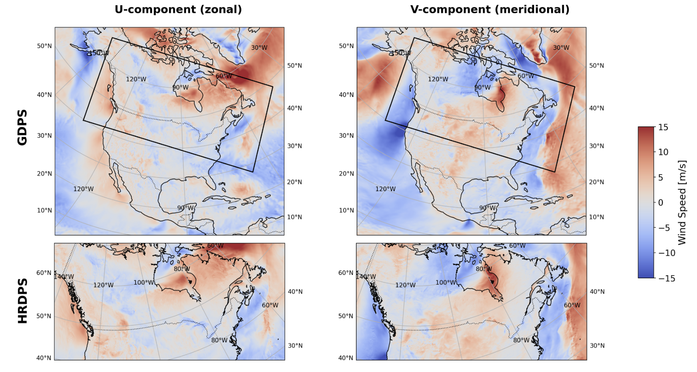

# Getting Started

This repository includes two example notebooks located in the `notebooks` folder:

- `eccc_downscaling_finetune.ipynb`
- `eccc_downscaling_inference.ipynb`

These notebooks demonstrate how to use the **Prithvi Weather Foundation Model** for a downscaling task on Canada’s operational Numerical Weather Prediction (NWP) systems. Specifically, the goal is to downscale forecasts from the **Global Deterministic Prediction System (GDPS)**—which provides 10-day forecasts at ~15 km resolution—to the **High-Resolution Deterministic Prediction System (HRDPS)**, which produces 48-hour forecasts at ~2.5 km resolution.

For more information about the dataset, see our preliminary work using GANs: [arxiv.org/pdf/2412.06958](https://arxiv.org/pdf/2412.06958)

The notebooks walk through the full pipeline using a single GDPS-HRDPS data pair, covering preprocessing, training, and inference. We also provide links to the full dataset and configuration files so you can run your own experiments.

---

# Dataset Description

### GDPS Inputs

| Variable         | Description                                                  | Units |
|------------------|--------------------------------------------------------------|--------|
| U<sub>surf</sub> | Zonal wind at surface (10 m)                                 | m/s    |
| V<sub>surf</sub> | Meridional wind at surface (10 m)                            | m/s    |
| T<sub>surf</sub> | Air temperature at surface (1.5 m)                           | °C     |
| U<sub>{500.0, 700.0, 850.0, 925.0, 1000.0}</sub>  | Zonal wind at {500.0, 700.0, 850.0, 925.0, 1000.0} hPa                                        | m/s    |
| V<sub>{500.0, 700.0, 850.0, 925.0, 1000.0}</sub>  | Meridional wind at {500.0, 700.0, 850.0, 925.0, 1000.0} hPa                                   | m/s    |
| T<sub>{500.0, 700.0, 850.0, 925.0, 1000.0}</sub>  | Air temperature at {500.0, 700.0, 850.0, 925.0, 1000.0} hPa                     | °C     |
| W<sub>{500.0, 700.0, 850.0, 925.0, 1000.0}</sub>  | Vertical motion at {500.0, 700.0, 850.0, 925.0, 1000.0} hPa                     | Pa/s   |
| HU<sub>{500.0, 700.0, 850.0, 925.0, 1000.0}</sub>  | Specific_humidity at {500.0, 700.0, 850.0, 925.0, 1000.0} hPa                     | Kg/Kg   |
| GZ<sub>{500.0, 700.0, 850.0, 925.0, 1000.0}</sub>  | Geopotential height at {500.0, 700.0, 850.0, 925.0, 1000.0} hPa                     | Dam   |


### HRDPS Targets

| Variable | Description                        | Units |
|----------|------------------------------------|--------|
| u10      | Zonal wind at surface (10 m)       | m/s    |
| v10      | Meridional wind at surface (10 m)  | m/s    |

### HRDPS Static Covariates

| Variable | Description        | Units     |
|----------|--------------------|-----------|
| me       | Orography          | m         |
| mg       | Water/land mask    | fraction  |
| z0       | Surface roughness  | m         |

---

# The Task

The objective is to downscale GDPS outputs by a factor of 8 to match the spatial resolution of HRDPS using the **Prithvi Weather Foundation Model**. The following data pipeline is used for preprocessing.

## Data Pipeline

- **Regridding**: GDPS and HRDPS are provided in different rotated coordinate systems. We regrid GDPS to match the HRDPS grid using nearest-neighbor interpolation.
- **Downsampling**: The regridded GDPS is downsampled by a factor of 8 to approximate a 20 km spatial resolution.
- **Scaler Computation**: Compute normalization scalers (mean and standard deviation) from the training partition.
- **Data Sampling**: Each GDPS-HRDPS pair is large (~1.5 GB), so we sample random spatial crops to form an intermediate dataset for training.
- **Static Covariates**: Static features (e.g., orography, roughness) are used to aid model learning.

## Model

We use a UNet architecture, integrating the **Prithvi encoder** as a deep feature extractor.

##  Files provided for running the example notebooks

You can download all required files from our [Hugging Face repository](https://huggingface.co/ibm-granite/granite-geospatial-wxc-downscaling).

We provide:

- **Configuration files**: YAML files containing experiment settings.
- **Sample data**: One preprocessed GDPS-HRDPS pair for demonstration.
- **Scalars**: Precomputed normalization statistics.
- **Indices**: JSON files mapping file paths for input/target data pairs.
- **Pretrained weights**: A model checkpoints.

---

# Step-by-step guide to setup the enviroment for running the notebooks

## Setup Virtual Enviroment

Python >= 3.10 is required

Using Conda
```
conda create -n granitewxc python=3.10
conda activate granitewxc
```

Using venv
```
python3.10 -m venv granitewxc
source granitewxc/bin/activate
```

Using uv
```bash
uv venv .granitewxc --python=python3.10
source .granitewxc/bin/activate
```

Note: When installing packages, use `uv pip install` instead of `pip install`


## Clone this repository:
```bash
git clone https://github.com/IBM/granite-wxc.git
cd granite-wxc/
pip install '.[examples]'
```
## Clone Hugging Face Repository

```bash
cd granite-wxc/
git clone https://huggingface.co/ibm-granite/granite-geospatial-wxc-downscaling
```

## Launch Jupyter Lab

```bash
jupyter lab --no-browser --ip $(hostname -f)
```
---

# Using the Full Dataset

The Hugging Face repository includes only a sample. In case you want to experiment with the full dataset, you can download the datasets from the following links:

- **HRDPS**: [Download](https://hpfx.collab.science.gc.ca/~snow000/hrdps_domain/hrdps/)
- **GDPS Regridded**: [Download](https://hpfx.collab.science.gc.ca/~snow000/hrdps_domain/gdps_regridded/)
- **GDPS Static data**: [Download - GDPS static](https://huggingface.co/ibm-granite/granite-geospatial-wxc-downscaling/blob/main/ECCC/data_sample/gdps_regridded/static_regridded_gdps.nc)
- **HRDPS Static data**:[Download - HRDPS static](https://huggingface.co/ibm-granite/granite-geospatial-wxc-downscaling/blob/main/ECCC/data_sample/hrdps/static_hrdps.nc)


### Data Preprocessing

Use `preprocess.py` to interpolate GDPS onto the HRDPS grid using nearest-neighbor interpolation. The regridded data is then downsampled by a factor of 8.


*Figure 1: Example of zonal and meridional winds on GDPS and HRDPS grids. HRDPS domain is shown by a black rectangle.*


> ***Obs***: Once regridding is complete, the GDPS data matches the HRDPS resolution. The Dataset class then handles downsampling automatically by a factor of eight, see the implementation in [eccc.py](https://github.com/victor-nasc/granite-wxc/blob/main/granitewxc/datasets/eccc.py)

### Index Files

You must define index files in JSON format for both input and static data.

**Data Pair Indices:**

```json
{
  "0": ["<GDPS_file.nc>", "<HRDPS_file.nc>"],
  "1": ["<GDPS_file.nc>", "<HRDPS_file.nc>"]
}
```

**Static Covariate Indices:**

```json
{
  "static_regridded_gdps": "<Static_GDPS_file.nc>",
  "static_hrdps": "<Static_HRDPS_file.nc>"
}
```

### Scaler Computation

Compute normalization statistics with:

```bash
python3 compute_scalars.py --config_path <CONFIG> --save_dir <DIR>
```

> **Note:** These statistics should be computed using only the training data.

---
### Training

To train with your own dataset, refer to `eccc_downscaling_finetune.ipynb` for an example setup. You will likely need to adapt the code into your own training script to train beyond the example.


